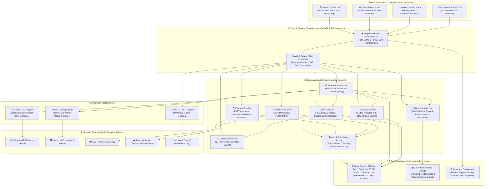
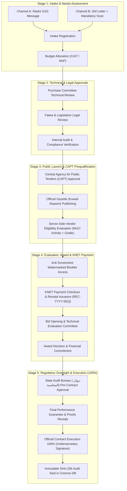
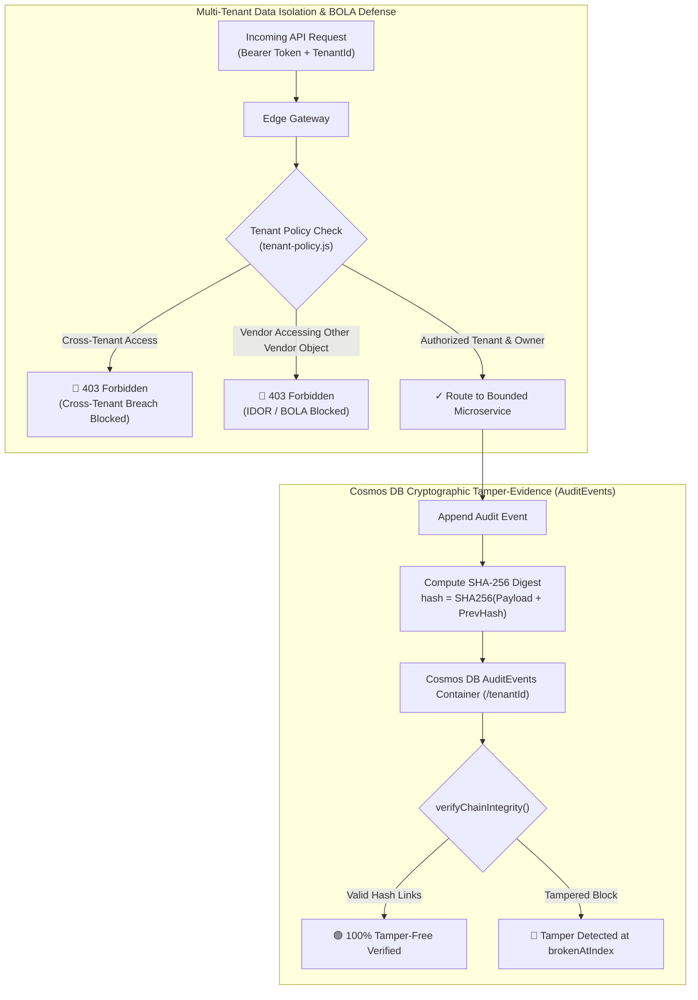

# KBM Procurement & Tender Management Platform — Complete System Architecture

```
========================================================================================
                      KBM ENTERPRISE MULTI-TENANT ARCHITECTURE
========================================================================================
```

## 1. High-Level Architectural Topology



---

## 2. End-to-End Tender Lifecycle Journey Architecture



---

## 3. Database Architecture & Multi-Tenant Partitioning

### Azure Cosmos DB Free Tier Specification

* **Account Name**: `kbm-cosmos-uyhsofjy5a23s` (West Europe)
* **Tier**: 100% Lifetime Free Tier (`enableFreeTier: true` — 1,000 RU/s + 25 GB storage free at $0.00/mo)
* **Database**: `kbm-procurement-db` (Shared 1,000 RU/s throughput)
* **Partition Key**: `/tenantId` (ensuring physical and logical isolation across all tenant collections)

```
kbm-procurement-db
├── 📁 Tenders       (Partition Key: /tenantId) — Published tenders, MoCI codes, pricing, eligibility rules
├── 📁 Vendors       (Partition Key: /tenantId) — Vendor registries, 3-grade tiers, suspensions, exemptions
├── 📁 Workflows     (Partition Key: /tenantId) — 35-step statutory approval task instances, SLAs, history
└── 📁 AuditEvents   (Partition Key: /tenantId) — Append-only SHA-256 cryptographic audit ledger
```

---

## 4. Multi-Tenant Data Isolation & BOLA Defense



---

## 5. Live Azure Deployment & Infrastructure Topology

| Architectural Component | Live Azure Resource | Configuration / SKU | Status |
| :--- | :--- | :--- | :---: |
| **Resource Group** | `rg-kbm-platform` (West Europe) | Azure Cloud Subscription | **Active** |
| **Web App (Host)** | `kbm-platform-portal` | Node 22 LTS (Linux App Service) | **🟢 Running (200 OK)** |
| **App Service Plan** | `kbm-bootstrap-asp` | Dedicated B1 (Linux) | **Active** |
| **NoSQL Database** | `kbm-cosmos-uyhsofjy5a23s` | **Azure Cosmos DB Free Tier (1,000 RU/s)** | **Active** |
| **Document Storage** | `kbmbootstrapsa` | Azure Blob Storage (Standard_LRS) | **Active** |
| **App Configuration** | `kbm-bootstrap-appconfig` | Azure App Configuration (Free Tier) | **Active** |
| **Live Portal URL** | `https://kbm-platform-portal.azurewebsites.net` | Public HTTPS Web App | **Active** |
