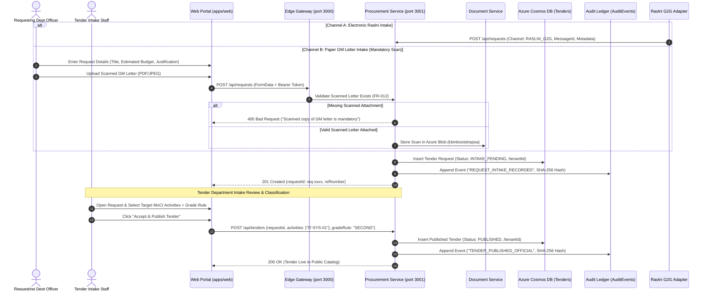
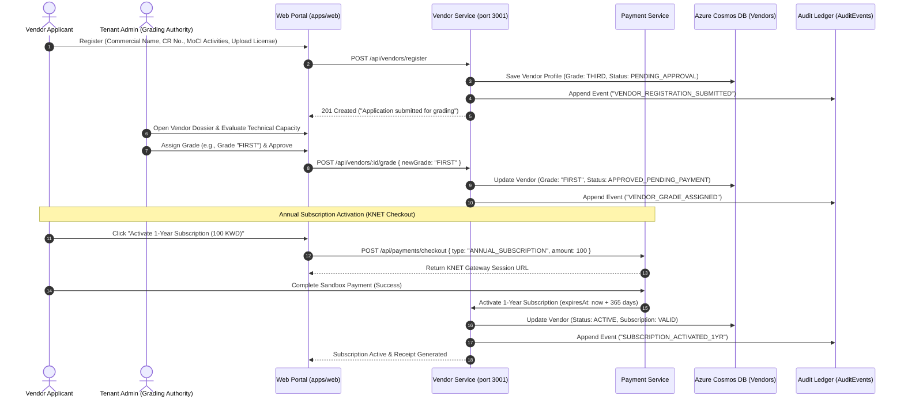
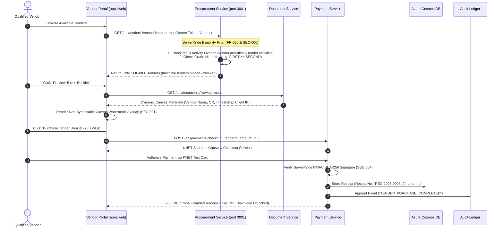
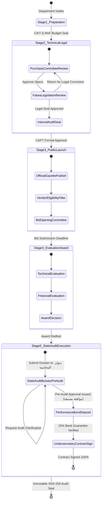

# KBM Platform — Functional Scenarios & User Journey Guide

```
==================================================================================================
                 KBM PROCUREMENT & TENDER MANAGEMENT SAAS PLATFORM
                    FUNCTIONAL SCENARIOS & STEP-BY-STEP USER JOURNEYS
==================================================================================================
```

## Document Overview

This document provides end-to-end functional specifications and execution walkthroughs for the core business scenarios of the **KBM Procurement & Tender Management Platform**. Each scenario details the user actions, business validation rules, API interactions, database state changes in Azure Cosmos DB, and statutory compliance checkpoints aligned with **State of Kuwait Public Tenders Law (Law No. 49/2016)** and the **Ministry of Interior Tender Platform BRD (v0.1)**.

---

## 1. Scenario 1: Tender Request Intake & Registration Cycle

### 1.1 Scenario Summary & Business Objective
* **Objective**: Enable requesting government departments and sectors (e.g., Information Technology, Border Security, Traffic Operations) to submit formal procurement and tender requests to the Central Tender Department through both automated electronic channels (Raslni G2G) and traditional paper channels (General Manager letter with mandatory scanned attachment).
* **Statutory Reference**: Law No. 49/2016 Articles 14–18 (Needs Assessment & Initiation).
* **BRD Requirements**: `FR-001`, `FR-002`, `FR-003`, `FR-004`, `FR-011`, `FR-012`, `FR-019`, `FR-020`, `DOC-001`, `AUD-001`.
* **Primary Actors**:
  1. **Requesting Department Officer (Staff Persona)**: Originates the procurement need.
  2. **Raslni G2G Integration Adapter**: Ingests automated inter-ministerial correspondence.
  3. **Tender Department Intake Officer (Staff Persona)**: Reviews, logs, and accepts incoming requests.
  4. **Tender Committee Administrator**: Targets MoCI activity codes, sets grade rules, and publishes the tender.



### 1.2 Step-by-Step Functional Walkthrough

| Step | Actor | Action / UI Screen | System Validation & Business Rules | Technical Endpoint / Payload | Resulting Cosmos DB State |
| :--- | :--- | :--- | :--- | :--- | :--- |
| **1.1** | Requesting Officer | Navigate to **Staff Portal $\rightarrow$ New Request Intake**. Select Channel: *Official Paper Letter*. | System renders mandatory scan upload field alongside reference number and budget. | UI Event `submitRequestForm` | Form ready for input validation. |
| **1.2** | Requesting Officer | Enter Title, Reference No. (`MOI/SEC/2026/088`), Budget, and attach scanned letter file (`gm_approval.pdf`). | **FR-012 Rule Check**: If `scannedLetter` is null/empty, submit is blocked with client and server error. | `POST /api/requests`<br/>`Content-Type: multipart/form-data` | `kbmbootstrapsa` Blob: `scans/req-xxxx.pdf` (SHA-256 Checksum stored). |
| **1.3** | Procurement Service | Validates payload, assigns internal sequence ID, logs tenant context. | Checks MIME type allowlist (`application/pdf`, `image/jpeg`). Computes payload SHA-256 hash. | `services/procurement-api/server.js` | `Tenders` container: Item created with `status: "INTAKE_PENDING"`. |
| **1.4** | Audit Service | Seals transaction into append-only cryptographic ledger. | Computes SHA-256 chaining: `hash = SHA256(eventPayload + previousHash)`. | `kbm-platform-audit-service/audit-store.js` | `AuditEvents` container: New block appended with incremented index. |
| **1.5** | Tender Staff | Opens **Intake Queue**, inspects scanned letter, selects target MoCI activity codes (`IT-SYS-01`) and Grade Rule (`SECOND_AND_ABOVE`). | Validates activity codes against MoCI ISIC catalog. Verifies budget allocation seal. | `POST /api/tenders`<br/>`{ requestId, priceKwd: 75, activities: ["IT-SYS-01"], gradeRule: "SECOND" }` | `Tenders` container: Item updated with `status: "PUBLISHED"`. |

### 1.3 Error Handling & Edge Cases
* **Missing Scanned GM Letter**: If a user submits a manual intake request without a scanned letter attachment, the system rejects the transaction with `HTTP 400 Bad Request` and error message: `"Scanned copy of GM letter is mandatory for manual request intake (FR-012)"`.
* **Invalid MIME Type**: Executable files (`.exe`, `.sh`, `.bat`) are blocked at the gateway boundary with `HTTP 415 Unsupported Media Type`.
* **Cross-Tenant Request Tampering**: If a staff member attempts to submit a request for a different tenant ID than their authenticated session, the request is immediately aborted with `HTTP 403 Forbidden` (`tenant-policy.js`).

---

## 2. Scenario 2: Vendor Registration, 3-Grade Classification & Subscription

### 2.1 Scenario Summary & Business Objective
* **Objective**: Provide an onboarding portal for commercial companies to register as qualified government vendors, submit qualification dossiers, receive evaluated classifications across 3 statutory grades (First, Second, Third Grade), complete 1-year annual KNET subscriptions, and handle date-range suspensions with automated reinstatement.
* **Statutory Reference**: Law No. 49/2016 Articles 21–25 (Vendor Classification & Prequalification).
* **BRD Requirements**: `FR-009`, `FR-010`, `FR-013`, `FR-014`, `FR-015`, `FR-016`, `FR-017`, `FR-018`, `DOC-003`, `DOC-004`, `NOT-001`..`NOT-005`.
* **Primary Actors**:
  1. **Vendor Applicant**: Registers commercial enterprise and uploads license files.
  2. **Grading & Classification Authority (Tenant Admin)**: Reviews financial/technical capacity and assigns grade.
  3. **KNET Payment Sandbox**: Processes annual subscription fee (KD 100/year).



### 2.2 Functional Walkthrough & Validation Matrix

| Step | Phase | Action & Rules | Data Contract | Cosmos DB Mutation |
| :--- | :--- | :--- | :--- | :--- |
| **2.1** | **Registration** | Vendor fills registration form with Commercial Registration (CR) number, civil ID of authorized signatory, and MoCI commercial activity codes (`IT-SYS-01`, `SEC-SURV-02`). | `POST /api/vendors/register`<br/>`{ name, crNumber, activities, email }` | `Vendors` container: New record with `status: "PENDING_APPROVAL"`, `grade: "THIRD"`. |
| **2.2** | **Grading** | Tenant Admin reviews submitted financial balances, past government contract execution history, and assigns **First Grade** (`FIRST`), **Second Grade** (`SECOND`), or **Third Grade** (`THIRD`). | `POST /api/vendors/:id/grade`<br/>`{ newGrade: "FIRST", reason: "Meets Class 1 capital criteria" }` | `Vendors` container: `grade` updated, audit history entry logged. |
| **2.3** | **Subscription** | Vendor pays the annual subscription fee via KNET (100 KWD). Fee-exempt vendors (e.g. designated SME entities under Law 74/2019) bypass checkout via Admin Exemption flag (`isFeeExempt: true`). | `POST /api/vendors/:id/subscribe`<br/>`{ paymentId: "knet-tx-9921", validUntil: "2027-08-29" }` | `Vendors` container: `subscriptionExpiresAt: "2027-08-29T..."`, `status: "ACTIVE"`. |
| **2.4** | **Suspension** | Admin suspends a non-compliant vendor by setting a date-range block (`blockedUntil: "2026-10-01"`). | `POST /api/vendors/:id/block`<br/>`{ blockedUntil: "2026-10-01", reason: "Delayed delivery" }` | `Vendors` container: `status: "SUSPENDED"`, `isBlocked: true`. |
| **2.5** | **Auto-Reinstatement** | When current time exceeds `blockedUntil`, the policy engine automatically restores vendor access to `ACTIVE` without requiring manual IT intervention. | Evaluated dynamically in `vendor-manager.js:isVendorActive()` | `isBlocked` evaluates to `false` when `now > blockedUntil`. |

---

## 3. Scenario 3: Tender Discovery, Server-Side Eligibility & KNET Purchase

### 3.1 Scenario Summary & Business Objective
* **Objective**: Ensure that vendors can discover, preview, and purchase published tender specification booklets in strict compliance with commercial classification targeting rules, while protecting document intellectual property via dynamic canvas anti-screenshot watermarking.
* **Statutory Reference**: Law No. 49/2016 Articles 31–36 (Tender Document Purchasing & Eligibility).
* **BRD Requirements**: `FR-005`, `FR-006`, `FR-007`, `FR-019`, `FR-020`, `SEC-001`, `SEC-002`, `SEC-004`, `SEC-006`, `DOC-002`, `DOC-005`.
* **Primary Actors**:
  1. **Qualified Commercial Vendor (Vendor Persona)**: Searches for tenders matching company activities.
  2. **Server-Side Eligibility Engine**: Matches MoCI activity overlap and grade rules.
  3. **Document Dynamic Watermark Canvas**: Renders anti-screenshot preview overlay.
  4. **KNET Payment Gateway**: Handles electronic booklet purchase and generates official receipt (`REC-YYYY-SEQ`).



### 3.2 Server-Side Eligibility Rules Matrix

The platform enforces strict server-side validation on every tender access attempt (`procurement-manager.js:isEligible()`):

```
                                  ELIGIBILITY DECISION TREE
                                  ─────────────────────────
                                     [ Incoming Request ]
                                              │
                                              ▼
                             Do activities overlap? (MoCI Code)
                             (vendor.activities ∩ tender.activities)
                                        /           \
                                      NO             YES
                                     /                 \
                          [ 🚫 INELIGIBLE ]      Grade Rule Mode?
                                                  /            \
                                    GRADE_AND_ABOVE            EXACT_GRADE
                                          /                         \
                               Vendor Grade >= Target?     Vendor Grade === Target?
                                     /         \                 /         \
                                   YES          NO             YES          NO
                                   /             \             /             \
                           [ 🟢 ELIGIBLE ]  [ 🚫 INELIGIBLE ] [ 🟢 ELIGIBLE ] [ 🚫 INELIGIBLE ]
```

| Vendor Grade | Tender Target Grade | Grade Matching Mode | Eligibility Result | System Behavior |
| :--- | :--- | :--- | :---: | :--- |
| **First Grade** (`FIRST`) | `SECOND` | `GRADE_AND_ABOVE` | **🟢 ELIGIBLE** | Full preview, purchase button active, specifications accessible. |
| **Third Grade** (`THIRD`) | `SECOND` | `GRADE_AND_ABOVE` | **🚫 INELIGIBLE** | Direct purchase blocked (`HTTP 403: Vendor grade THIRD does not qualify for Grade SECOND tender`). |
| **First Grade** (`FIRST`) | `SECOND` | `EXACT_GRADE` | **🚫 INELIGIBLE** | Blocked because exact grade match required for targeted SME tenders. |
| **Any Grade** | *Non-overlapping MoCI activities* | *Any* | **🚫 INELIGIBLE** | Tender hidden from catalog; direct URL access returns `HTTP 403 Forbidden`. |

---

## 4. Scenario 4: Statutory Approval Workflow & State Audit Bureau Oversight

### 4.1 Scenario Summary & Business Objective
* **Objective**: Manage the multi-department statutory review and approval process for Practices (8 sequential tasks) and Tenders (35 sequential tasks), enforcing role-based task claiming, SLA deadline tracking, return-for-correction loops, and pre-contract approval from the **State Audit Bureau (ديوان المحاسبة)** before final 100% Undersecretary contract signing.
* **Statutory Reference**: Law No. 49/2016 Articles 38–62 & State Audit Bureau Law No. 30/1964.
* **BRD Requirements**: `FR-026`, `FR-027`, `FR-031`, `AUD-001`.
* **Primary Actors**:
  1. **Purchase Committee Inspector**: Validates technical specifications and tender terms.
  2. **Legal & Fatwa Representative**: Verifies regulatory alignment.
  3. **State Audit Bureau Auditor (ديوان المحاسبة)**: Performs statutory pre-audit review (الرقابة المسبقة).
  4. **Undersecretary (وكيل الوزارة)**: Executes final contract (100% Milestone).



### 4.2 Workflow State Machine Transition Matrix

| Task ID | Task Description (Bilingual) | Required Role | Valid Next Actions | SLA Threshold | Rejection / Correction Path |
| :--- | :--- | :--- | :--- | :--- | :--- |
| **TSK-001** | Needs Survey & Specification Prep<br/>إعداد دراسة الاحتياجات والمواصفات | `STAFF_INITIATOR` | `SUBMIT_FOR_REVIEW` | 5 Business Days | Re-draft internally. |
| **TSK-007** | Purchase Committee Review<br/>مراجعة لجنة الشراء واعتماد الكراسة | `PURCHASE_COMMITTEE` | `APPROVE`, `RETURN_CORRECTION` | 7 Business Days | Returns to `STAFF_INITIATOR` with feedback comments. |
| **TSK-014** | Fatwa & Legislation Legal Audit<br/>مراجعة إدارة الفتوى والتشريع | `LEGAL_COUNSEL` | `LEGAL_SEAL_APPROVED`, `RETURN_CORRECTION` | 10 Business Days | Returns to `PURCHASE_COMMITTEE` for clause adjustments. |
| **TSK-021** | CAPT Board Approval & Publishing<br/>موافقة الجهاز المركزي للمناقصات والنشر | `CAPT_LIAISON` | `PUBLISH_GAZETTE` | 14 Business Days | Escalates to Committee Chair if SLA breached. |
| **TSK-031** | State Audit Bureau Pre-Audit<br/>الرقابة المسبقة لديوان المحاسبة | `STATE_AUDIT_LIAISON` | `AUDIT_APPROVED`, `AUDIT_OBJECTION` | 15 Business Days | Halts workflow until formal response letter uploaded. |
| **TSK-035** | Undersecretary Final Signing (100%)<br/>توقيع العقد النهائي من وكيل الوزارة | `UNDERSECRETARY` | `EXECUTE_CONTRACT_100` | 3 Business Days | Generates final SHA-256 cryptographic seal in Cosmos DB. |

---

## 5. Security & Cryptographic Verification Walkthrough

### 5.1 Append-Only Audit Hash Chaining (SHA-256)
Whenever an action occurs in any of the 4 scenarios, the platform records a block in the `AuditEvents` Cosmos DB container:

```javascript
// Hash Chaining Algorithm (kbm-platform-audit-service/audit-store.js)
function appendEvent(tenantId, action, actor, payload) {
  const previousEvent = getLatestEvent(tenantId);
  const previousHash = previousEvent ? previousEvent.hash : '0000000000000000000000000000000000000000000000000000000000000000';
  const timestamp = new Date().toISOString();
  
  const rawString = JSON.stringify({
    tenantId,
    action,
    actor,
    payload,
    previousHash,
    timestamp
  });
  
  const hash = crypto.createHash('sha256').update(rawString).digest('hex');
  
  const auditBlock = {
    id: `evt-${crypto.randomUUID()}`,
    tenantId,
    action,
    actor,
    payload,
    previousHash,
    hash,
    timestamp
  };
  
  cosmosContainer.items.create(auditBlock);
  return auditBlock;
}
```

### 5.2 Dynamic Canvas Anti-Screenshot Watermarking Schema
When a vendor views tender documents, the frontend injects a dynamic HTML5 canvas layer overlaying the document viewport:
* **Watermark Pattern**: Diagonal repeating watermark with 45-degree angle.
* **Injected Metadata**: Vendor Commercial Name (`KBM Tech General Trading`), CR Number (`CR-948210`), Authenticated User Email, Real-Time Timestamp (`2026-08-29 18:06:37`), and Client IP Address.
* **Canvas Resistance**: Canvas is rendered with `pointer-events: none` and user-select disabled; screenshot or camera capture visibly displays tracking watermark identifying the leaking entity.

---

## 6. Summary of Scenario Verification & Test Coverage

All 4 scenarios are verified by 35 native automated tests and an end-to-end multi-step cycle verification script:

| Scenario | Primary Unit / Integration Test Suites | Automated Test Script Command |
| :--- | :--- | :--- |
| **Scenario 1 (Tender Intake)** | `procurement-manager.test.js`, `integration-adapters.test.js` | `npm test` |
| **Scenario 2 (Vendor & Grading)** | `vendor-manager.test.js`, `payment-manager.test.js` | `npm test` |
| **Scenario 3 (Eligibility & KNET)** | `procurement-manager.test.js`, `document-manager.test.js`, `tenant-policy.test.js` | `npm test` |
| **Scenario 4 (35-Step Statutory Workflow)** | `workflow-engine.test.js`, `audit-store.test.js` | `npm test` |
| **Complete End-to-End Cycle** | 12-step simulated multi-persona lifecycle test | `node scripts/test-complete-cycle.mjs` |
